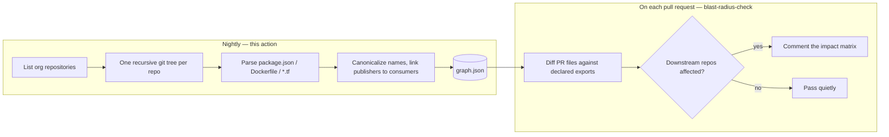

# 💥 Cross-Repo Blast Radius Indexer

[](https://github.com/mchittineni/blast-radius-indexer/actions/workflows/ci.yml)
[](https://github.com/mchittineni/blast-radius-indexer/actions/workflows/check-dist.yml)
[](LICENSE)

A zero-SaaS GitHub Action that scans your organization's repositories and builds a
**cross-repo dependency graph** — which repository publishes each shared npm
package, container image, and Terraform module, and which repositories consume it.

The graph it writes (`graph.json`) is consumed by
[**blast-radius-check**](https://github.com/mchittineni/blast-radius-check), which
comments on pull requests with the downstream repositories they put at risk.

---

## How the two actions fit together



The split is deliberate: indexing an organization costs hundreds of API calls, so
it runs once a night, while the pull-request check only reads the result.

---

## Quick start

Add a nightly workflow to the repository that should hold the graph:

```yaml
name: Nightly dependency graph

on:
  schedule:
    - cron: '0 2 * * *'
  workflow_dispatch:

permissions:
  contents: write # to commit graph.json

jobs:
  index:
    runs-on: ubuntu-latest
    steps:
      - uses: actions/checkout@v4

      - id: index
        uses: mchittineni/blast-radius-indexer@v1
        with:
          org-name: ${{ github.repository_owner }}
          github-token: ${{ secrets.ORG_READ_TOKEN }}
          output-path: graph.json

      - name: Commit the updated graph
        env:
          REPOS: ${{ steps.index.outputs.repo-count }}
        run: |
          git config user.name 'github-actions[bot]'
          git config user.email 'github-actions[bot]@users.noreply.github.com'
          git add graph.json
          git diff --staged --quiet && exit 0
          git commit -m "chore: refresh dependency graph ($REPOS repos) [skip ci]"
          git push
```

`secrets.GITHUB_TOKEN` cannot read other repositories. You need a token with
`contents: read` across the repositories you want indexed — a fine-grained PAT or
a GitHub App installation token. See [SECURITY.md](SECURITY.md).

### Try it with no token at all

`local-path` scans a directory of repositories instead of calling the API, which
is the fastest way to see the output shape:

```bash
mkdir -p fixture/lib fixture/app
echo '{"name":"@acme/ui","version":"2.1.0"}' > fixture/lib/package.json
echo '{"name":"@acme/app","private":true,"dependencies":{"@acme/ui":"^2.0.0"}}' > fixture/app/package.json

npm ci && npm run build

# `env` is required because the variable names contain hyphens, which most shells
# reject in the `VAR=value command` form.
env 'INPUT_ORG-NAME=acme' 'INPUT_LOCAL-PATH=fixture' 'INPUT_OUTPUT-PATH=graph.json' \
  node dist/index.js
```

---

## Inputs

| Input                | Required            | Default      | Description                                                                        |
| :------------------- | :------------------ | :----------- | :--------------------------------------------------------------------------------- |
| `org-name`           | **yes**             | —            | Organization or user whose repositories are scanned.                               |
| `github-token`       | unless `local-path` | `''`         | Token with `contents: read` on the repositories to index.                          |
| `output-path`        | no                  | `graph.json` | Where the graph is written.                                                        |
| `local-path`         | no                  | `''`         | Scan a directory of repositories instead of the API.                               |
| `include-archived`   | no                  | `false`      | Include archived repositories.                                                     |
| `include-forks`      | no                  | `false`      | Include forks.                                                                     |
| `repo-filter`        | no                  | `''`         | Case-insensitive substring, or `/regex/` in slashes, matched against `owner/name`. |
| `max-files-per-repo` | no                  | `200`        | Cap on indexable files read per repository; shallowest paths win.                  |
| `concurrency`        | no                  | `8`          | Repositories scanned in parallel.                                                  |

## Outputs

| Output                  | Description                                      |
| :---------------------- | :----------------------------------------------- |
| `graph-path`            | Path the graph was written to.                   |
| `repo-count`            | Repositories indexed.                            |
| `artifact-count`        | Distinct artifacts discovered.                   |
| `shared-artifact-count` | Artifacts with at least one downstream consumer. |
| `consumer-edge-count`   | Total publisher-to-consumer edges.               |
| `warning-count`         | Non-fatal warnings raised during the scan.       |

---

## What gets detected

An edge is only created when a publisher's declaration and a consumer's reference
reduce to the **same canonical name**, so both sides are normalized first.

| Type          | Publisher declares                              | Consumer references                                                           | Canonical form                                     |
| :------------ | :---------------------------------------------- | :---------------------------------------------------------------------------- | :------------------------------------------------- |
| **npm**       | `package.json` `name`, not `private: true`      | `dependencies`, `devDependencies`, `peerDependencies`, `optionalDependencies` | the package name                                   |
| **docker**    | any `Dockerfile` → the image its repo publishes | `FROM owner/image:tag`                                                        | `owner/repo`, also matched as `ghcr.io/owner/repo` |
| **terraform** | a `*.tf` file at the repository root            | `source = "…"` in any `*.tf`                                                  | `host/owner/repo`                                  |

Normalization handles the awkward real-world spellings:

- `docker.io/acme/x`, `index.docker.io/library/x`, and `acme/x` reduce to the same
  image, while `ghcr.io/acme/x` and `quay.io/acme/x` stay distinct.
- `localhost:5000/acme/x` treats the colon as a registry port, not a tag.
- `git::https://github.com/acme/m.git//modules/x?ref=v1`, `git@github.com:acme/m.git`,
  and `github.com/acme/m` all reduce to `github.com/acme/m`.

Deliberately **not** counted as cross-repo edges:

- Official single-segment base images (`node`, `alpine`).
- Multi-stage `FROM builder` references, and `FROM ${ARG}` that cannot be resolved
  statically.
- `file:`, `link:`, `workspace:`, and git-URL dependency specs.
- Local Terraform sources (`./modules/x`).
- A repository consuming its own artifact.
- Anything under `node_modules/`, `.terraform/`, `vendor/`, `dist/`, `build/`.

Adding a type is a small, well-defined change — see [CONTRIBUTING.md](CONTRIBUTING.md).

---

## `graph.json` shape

```jsonc
{
  "schemaVersion": 1,
  "generatedAt": "2026-08-12T02:00:00.000Z",
  "org": "acme",
  "warnings": ["acme/legacy: git tree was truncated by the API"],
  "artifacts": {
    "npm:@acme/core-ui": {
      "type": "npm",
      "name": "@acme/core-ui",
      "publisherRepo": "acme/core-ui-lib",
      "publisherFile": "package.json",
      "consumers": [
        {
          "repo": "acme/user-portal",
          "sourceFile": "package.json",
          "versionRequirement": "^2.0.0",
        },
      ],
    },
  },
  "repos": {
    "acme/core-ui-lib": { "repo": "acme/core-ui-lib", "exports": [], "imports": [] },
  },
}
```

Keys and consumer lists are sorted, so a nightly commit produces a diff that shows
what actually changed rather than a reshuffle.

`schemaVersion` is the contract with the checker, which refuses a graph newer than
it understands instead of misreading it.

---

## Honest caveats

1. **Nightly-fresh, not real-time.** The graph reflects the last index run. The
   checker warns on a pull request when the graph is more than 48 hours old.
2. **Static analysis of declarations.** It reads manifests, not build systems. A
   dependency injected at build time, or an image tag templated by CI, is invisible.
3. **Naming heuristics.** A Dockerfile does not name its own output image, so the
   published name is derived from the repository. If your pipeline pushes to an
   image name unrelated to the repository, that edge will not link.
4. **API-limited discovery.** One recursive tree call per repository is capped by
   GitHub; very large repositories report a truncation warning rather than
   silently indexing a subset.
5. **`max-files-per-repo` truncates.** When exceeded, the shallowest paths are
   indexed and a warning names the count that was dropped.

---

## Contributing

See [CONTRIBUTING.md](CONTRIBUTING.md). Note the one rule that surprises everyone:
`dist/` is a committed build artifact, and `npm run build` must be run with every
source change.

- [Code of Conduct](CODE_OF_CONDUCT.md)
- [Security policy](SECURITY.md)
- [Marketplace publishing](docs/MARKETPLACE.md)

## License

[MIT](LICENSE)
